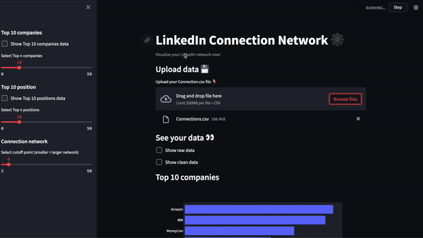

# Linkedin Connections Insights 🪄

[](https://share.streamlit.io/benthecoder/linkedin-visualizer/main/app.py)

Get helpful statistics on your LinkedIn connection now!




To try this app out, first download your connections data. Here's how 👇

1. Click on your Me drop-down on the homepage
1. Head over to “Settings & Privacy”
1. Click on “Data Privacy”
1. Click on “Get a copy of your data”

Read the article to know more about this project: [Visualize your LinkedIn Network with Python](https://medium.com/bitgrit-data-science-publication/visualize-your-linkedin-network-with-python-59a213786c4)

## Features

This app tells you the information below

- Total connections on LinkedIn
- Where most of your connections work at
- Who most of your connections are (what job title they hold)
- Who you last connected with
- Who you first connected with (send them a message!)
- Bar chart of top companies and positions
- Time series plot of your connections over time (find out when you had the most connections)
- A graph/network of your connections (see your connections in a graph)
- Last but not least, a "who you can cold email" section that provides a list of emails of your connections (perks of LinkedIn connections!)

[Use it now!](https://share.streamlit.io/benthecoder/linkedin-visualizer/main/app.py)

## Run Locally

Clone the project

```bash
  git clone https://github.com/benthecoder/linkedin-visualizer.git
```

Go to the project directory

```bash
  cd linkedin-visualizer
```

Create Conda environment

```bash
  conda create --name env_name python=3.8
```

Activate the environment

```bash
  conda activate env_name
```

Install requirements

```bash
  pip install -r requirements.txt
```

Run streamlit

```bash
  streamlit run app.py
```


## Contributing

Contributions are always welcome!

## License

[MIT](https://choosealicense.com/licenses/mit/)
